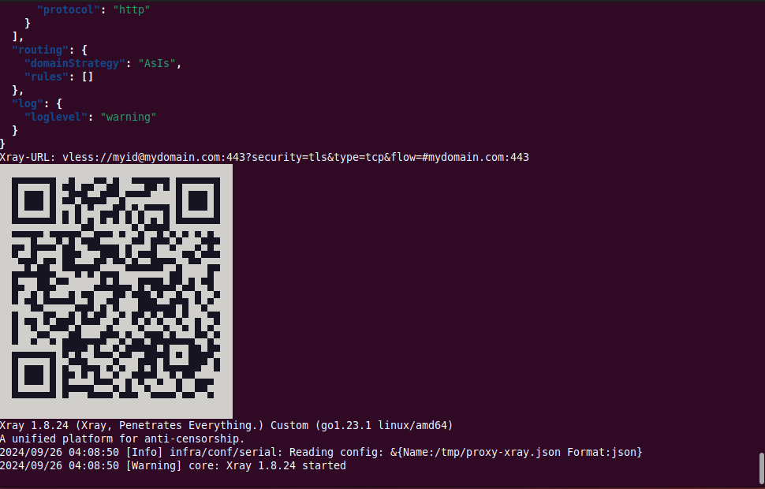

# proxy-xray

[Xray-Core](https://github.com/XTLS/Xray-core) is a low detectable VPN. proxy-xray is a Xray-Core client container that runs Xray-Core with config file generated from command line options automatically hence remove the necessity of config file modification.

Please have a look over the sibling project [server-xray](https://github.com/samuelhbne/server-xray) if you'd like to setup a Xray-Core server first.


## Quick start

The following command will create a VLESS-TCP-TLS-XTLS client connecting to mydomain.com  port 443 with given uid. Expose Socks-proxy port 1080 as a local service.

```shell
$ docker run --rm -it -p 1080:1080 samuelhbne/proxy-xray --lttx myid@mydomain.com:443
...
```

The following command will create a VLESS-SplitHTTP-TLS-HTTP3 client connecting to mydomain.com port 443 with given uid and webpath. Expose Socks-proxy port 1080 as a local service.

```shell
$ docker run --rm -it -p 1080:1080 samuelhbne/proxy-xray --lst3 myid@mydomain.com:443:/split0
...
```

The following command will create a VLESS-TCP-REALITY-XTLS client connecting to mydomain.com port 443 with given uid, applying yahoo.com as fake destnation, exposing Socks-proxy port 1080, http-proxy port 8123, DNS port 53 as local services. Websites and IP located in China will not be proxied. China-accessible domains will be resolved locally hence to accelerate the local access.

```shell
$ docker run --rm -it -p 1080:1080 -p 1080:1080/udp -p 8123:8123 -p 53:53/udp \
--name proxy-xray samuelhbne/proxy-xray --cn-direct --dns-local-cn \
--ltrx myid@mydomain.com:443,d=yahoo.com,pub=qAaJnTE_zYWNuXuIdlpIfSt5beveuV4PyBaP76WE7jU
...
```

** NOTE **

Name query for sites outside China like twitter.com will be always forwarded to designated DNS (1.1.1.1 by default) to avoid the contaminated results. Name query for sites inside China like apple.com.cn will be forwarded to local DNS servers in China to avoid cross region slow access when "--dns-local-cn" options applied. Otherwise all queries will be forwarded to designated DNS server.

## How to verify if proxy tunnel is working properly

```shell
$ curl -sSx socks5h://127.0.0.1:1080 https://checkip.amazonaws.com
12.34.56.78

$ curl -sSx http://127.0.0.1:8123 https://checkip.amazonaws.com
12.34.56.78

$ dig +short @127.0.0.1 -p 53 twitter.com
104.244.42.193
104.244.42.129

$ docker exec proxy-xray proxychains whois 104.244.42.193|grep OrgId
[proxychains] config file found: /etc/proxychains/proxychains.conf
[proxychains] preloading /usr/lib/libproxychains4.so
[proxychains] DLL init: proxychains-ng 4.14
[proxychains] Strict chain  ...  127.0.0.1:1080  ...  whois.arin.net:43  ...  OK
OrgId:          TWITT
```

** NOTE **

- curl should return the Xray server address given above if SOCKS5/HTTP proxy works properly.
- dig should return resolved IP recorders of twitter.com if DNS server works properly.
- Whois should return "OrgId: TWITT". That means the IP address returned from dig query belongs to twitter.com indeed, hence untaminated.
- Whois was actually running inside the proxy container through the proxy tunnel to avoid potential access blocking.

## How to get the XRay QR code for mobile connection

proxy-xray always display the QR code after the successful config file generation.

```shell
$ docker run --name proxy-xray --rm -it -p 1080:1080 samuelhbne/proxy-xray --ltt myid@mydomain.com
```



Also, you can always retrive the QR code as following in case you ran the container in daemon mode hence did not get it from the console output.

```shell
$ docker exec -t proxy-xray /qrcode
```

## Full usage

```shell
$ docker run --rm samuelhbne/proxy-xray
proxy-xray <connection-options>
    --lgp  <VLESS-GRPC-PLN option>        id@host:port:svcname
    --lgr  <VLESS-GRPC-RLTY option>       id@host:port:svcname,d=fakedest.com,pub=xxxx[,shortId=abcd]
    --lgt  <VLESS-GRPC-TLS option>        id@host:port:svcname
    --lsp  <VLESS-SPLT-PLN option>        id@host:port:/webpath
    --lst  <VLESS-SPLT-TLS option>        id@host:port:/webpath[,alpn=h3]
    --lst3 <VLESS-SPLT-TLS-HTTP3 option>  id@host:port:/webpath
    --ltr  <VLESS-TCP-RLTY option>        id@host:port,d=dest.com,pub=xxxx[,shortId=abcd][,xtls]
    --ltrx <VLESS-TCP-RLTY-XTLS option>   id@host:port,d=dest.com,pub=xxxx[,shortId=abcd]
    --ltt  <VLESS-TCP-TLS option>         id@host:port[,xtls]
    --lttx <VLESS-TCP-TLS-XTLS option>    id@host:port
    --lwp  <VLESS-WS-PLN option>          id@host:port:/wspath
    --lwt  <VLESS-WS-TLS option>          id@host:port:/wspath
    --mtt  <VMESS-TCP-TLS option>         id@host:port
    --mwp  <VMESS-WS-PLN option>          id@host:port:/wspath
    --mwt  <VMESS-WS-TLS option>          id@host:port:/wspath
    --ttt  <TROJAN-TCP-TLS option>        password@host:port
    --twp  <TROJAN-WS-PLN option>         password@host:port:/wspath
    --twt  <TROJAN-WS-TLS option>         password@host:port:/wspath
    -d|--debug                            Start in debug mode with verbose output
    -i|--stdin                            Read config from stdin instead of auto generation
    -j|--json                             Json snippet to merge into the config. Say '{log:{loglevel:info}'
    --dns  <upstream-DNS-ip>              Designated upstream DNS server IP, 1.1.1.1 will be applied by default
    --dns-local-cn                        Enable China-accessible domains to be resolved in China
    --domain-direct <domain-rule>         Add a domain rule for direct routing, like geosite:geosite:geolocation-cn
    --domain-proxy  <domain-rule>         Add a domain rule for proxy routing, like twitter.com or geosite:google-cn
    --domain-block  <domain-rule>         Add a domain rule for block routing, like geosite:category-ads-all
    --ip-direct     <ip-rule>             Add a ip-addr rule for direct routing, like 114.114.114.114/32 or geoip:cn
    --ip-proxy      <ip-rule>             Add a ip-addr rule for proxy routing, like 1.1.1.1/32 or geoip:netflix
    --ip-block      <ip-rule>             Add a ip-addr rule for block routing, like geoip:private
    --cn-direct                           Add routing rules to avoid domains and IPs located in China being proxied
    --rules-path    <rules-dir-path>      Folder path contents geoip.dat, geosite.dat and other rule files
```

## How to start the proxy container as a daemon and stop/remove the daemon thereafter

```shell
$ docker run --name proxy-1080 -d -p 1080:1080 samuelhbne/proxy-xray --lttx myid@mydomain.com:443
$ docker stop proxy-1080
$ docker rm proxy-1080
```

## More complex examples

### 1. Connect to Vless-TCP-TLS-XTLS server

The following instruction connect to mydomain.duckdns.org port 443 in Vless+TCP+XTLS mode. Connection made via IP address to avoid DNS contamination. TLS servername provided via parameter. All destination sites and IP located in China will not be proxied.

```shell
$ docker run --rm -it -p 1080:1080 -p 1080:1080/udp samuelhbne/proxy-xray \
--lttx myid@12.34.56.78:443,serverName=mydomain.duckdns.org --cn-direct
```

### 2. Connect to Vless-Websocket-TLS server

The following instruction connect to Xray server port 443 in Vless+TCP+TLS+Websocket mode with given id. All apple-cn sites will be proxied. All sites located in China will not be proxied.

```shell
$ docker run --rm -it -p 1080:1080 samuelhbne/proxy-xray \
--lwt myid@mydomain.duckdns.org:443:/websocket \
--domain-proxy geosite:apple-cn --domain-direct geosite:geolocation-cn
```

### 3. Connect to Vless-gRPC-TLS server

The following instruction connect to Xray server port 443 in Vless-gRPC-TLS mode with given password. All sites not located in China will be proxied. You need to escape '!' character in --domain-proxy parameter to be accepted by shell.

```shell
$ docker run --rm -it -p 1080:1080 samuelhbne/proxy-xray \
--lgt myid@mydomain.duckdns.org:443:gsvc --domain-proxy geosite:geolocation-\!cn
```

### 4. Connect to TCP-Trojan-TLS server

The following instruction connect to Xray server port 443 in TCP-Trojan-TLS mode with given password; Update geosite and geoip rule dat files; All sites and IPs located in Iran will be connected directly. All Iran-related domains that are blocked inside of iran will be proxied.

```shell
$ docker run --rm -it -p 1080:1080 samuelhbne/proxy-xray \
--ttt trojan_pass@mydomain.duckdns.org:8443 \
--domain-direct ext:iran.dat:ir --ip-direct geoip:ir --domain-proxy ext:iran.dat:proxy
```

#### In case you need to run proxy-xray with updated geosite/geoip dat files.

```shell
$ mkdir -p /tmp/rules
$ cd /tmp/rules
$ wget -c -t3 -T30 https://github.com/Loyalsoldier/v2ray-rules-dat/releases/latest/download/geoip.dat
$ wget -c -t3 -T30 https://github.com/Loyalsoldier/v2ray-rules-dat/releases/latest/download/geosite.dat
$ wget -c -t3 -T30 https://github.com/SamadiPour/iran-hosted-domains/releases/download/202507140045/iran.dat
$ docker run --rm -it -p 1080:1080 -v /tmp/rules:/opt/rules samuelhbne/proxy-xray \
--ttt trojan_pass@mydomain.duckdns.org:8443 \
--rules-path /opt/rules --domain-direct ext:iran.dat:ir --ip-direct geoip:ir --domain-proxy ext:iran.dat:proxy
```

### 5. Start proxy-xray container in debug mode for for connection issue diagnosis

The following instruction start proxy-xray in debug mode. Output Xray config file generated and the Xray log to console for connection diagnosis.

```shell
$ docker run --rm -it -p 1080:1080 samuelhbne/proxy-xray \
--mwt myid@mydomain.duckdns.org:443:/websocket --debug
```

### NOTE 4

For more details about routing rules setting up please look into [v2ray-rules-dat](https://github.com/Loyalsoldier/v2ray-rules-dat) project (Chinese).

## Build proxy-xray docker image matches the current host architecture

```shell
$ git clone https://github.com/samuelhbne/proxy-xray.git
$ cd proxy-xray
$ docker build -t samuelhbne/proxy-xray .
...
```

### Cross-compile docker image for the platforms with different architecture

Please refer the [official doc](https://github.com/docker/buildx) for docker-buildx installation

```shell
docker buildx build --platform=linux/arm/v7 --output type=docker -t samuelhbne/proxy-xray:armv7 .
docker buildx build --platform=linux/arm/v6 --output type=docker -t samuelhbne/proxy-xray:armv6 .
docker buildx build --platform=linux/arm64 --output type=docker -t samuelhbne/proxy-xray:arm64 .
docker buildx build --platform=linux/amd64 --output type=docker -t samuelhbne/proxy-xray:amd64 .
```

## Credits

Thanks to [RPRX](https://github.com/RPRX) for [Xray-core](https://github.com/XTLS/Xray-core).

Thanks to [Loyalsoldier](https://github.com/Loyalsoldier) for [v2ray-rules-dat](https://github.com/Loyalsoldier/v2ray-rules-dat).

Thanks to [felixonmars](https://github.com/felixonmars) for [dnsmasq-china-list](https://github.com/felixonmars/dnsmasq-china-list).

Thanks to [SamadiPour](https://github.com/SamadiPour) for [iran-hosted-domains](https://github.com/SamadiPour/iran-hosted-domains).

Thanks to [FUKUCHI Kentaro](https://fukuchi.org/index.html.en) for [libqrencode](https://fukuchi.org/works/qrencode/).